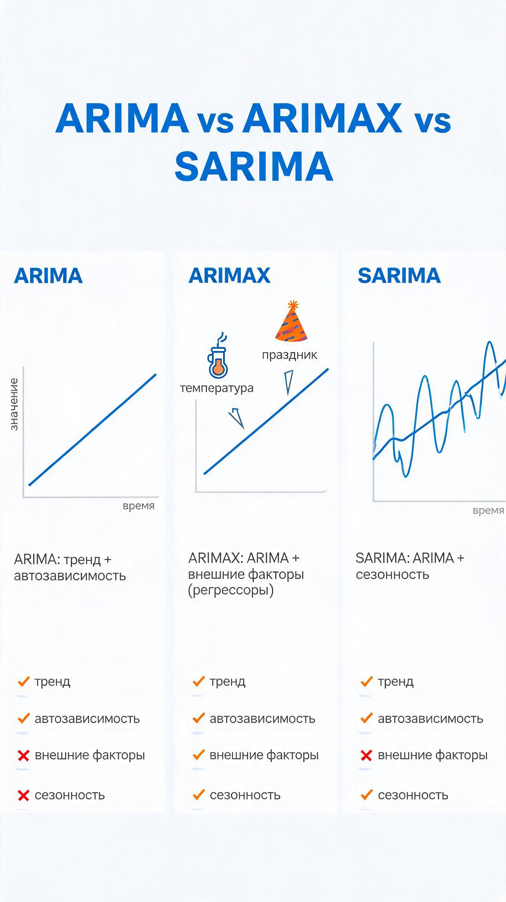
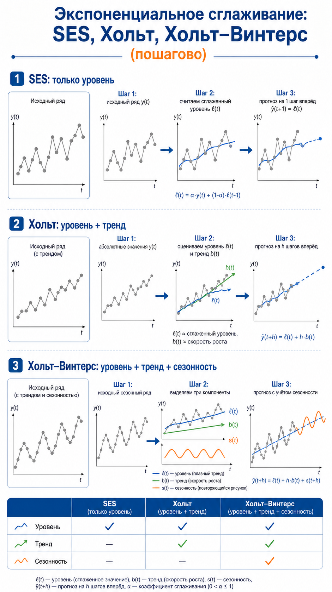

# Раздел IV. Анализ и прогнозирование временных рядов
>
> *Time Series Analysis & Forecasting*

***

## 1. Временной ряд: понятие и классификация

**Временной ряд** — последовательность значений некоторого показателя, упорядоченных по времени.

> *«Временной ряд — собранный в разные моменты времени статистический материал о значении каких-либо параметров исследуемого процесса»* — [Habr: Временные ряды и ARIMA](https://habr.com/ru/articles/821231/)

```
t:  1    2    3    4    5    6
y: 120  128  131  145  160  158
```


Стационарный временной ряд на примере синуса

### Компоненты ряда


Любой ряд разложим на части:

| Компонент | Обозначение | Смысл |
|---|---|---|
| Тренд | T | Устойчивое долгосрочное направление |
| Сезонность | S | Повторяющийся паттерн (день, неделя, год) |
| Цикличность | C | Долгие нерегулярные колебания |
| Остаток | R | Случайный шум |

**Аддитивная модель** — амплитуда сезонности не зависит от уровня:

$$y_t = T_t + S_t + C_t + \varepsilon_t$$

**Мультипликативная модель** — амплитуда растёт вместе с уровнем:

$$y_t = T_t \cdot S_t \cdot C_t \cdot \varepsilon_t$$

> **Пример**: продажи ёлок — мультипликативная сезонность (чем выше общий спрос, тем выше пик декабря).

*Декомпозиция ряда на тренд, сезонность и остаток — Wikipedia STL*

### Классификация рядов

```
Временные ряды
 ├─ По стационарности
 │   ├─ Стационарный (постоянные среднее и дисперсия)
 │   └─ Нестационарный (с трендом, гетероскедастичный)
 ├─ По сезонности
 │   ├─ Сезонный
 │   └─ Несезонный
 ├─ По частоте
 │   ├─ Высокочастотный (тики, минуты)
 │   └─ Низкочастотный (месяцы, кварталы)
 └─ По размерности
     ├─ Одномерный
     └─ Многомерный (векторный)
```

> [Habr: Анализ временных рядов — полное руководство](https://habr.com/ru/companies/skillfactory/articles/860660/)

***

## 2. Интуитивные методы прогнозирования

**Интуитивные методы** — прогноз строится на суждениях экспертов, а не на математической модели.

> *«Интуитивные методы прогнозирования имеют дело с суждениями и оценками экспертов»* — [Habr: Классификация методов прогнозирования](https://habr.com/ru/articles/177633/)


### Когда применяются

- Нет данных или их слишком мало.
- Среда слишком сложна для формализации (политика, кризисы).
- Нужен быстрый ориентировочный прогноз.

### Основные экспертные методы

| Метод | Суть | Применение |
|---|---|---|
| Индивидуальная оценка | Один эксперт | Простые задачи |
| Метод Дельфи | Несколько туров анонимных опросов | Стратегическое планирование |
| Мозговой штурм | Генерация идей группой | Новые рынки, продукты |
| Сценарный подход | 3 сценария: оптимистичный / базовый / пессимистичный | Бизнес-планирование |

### Метод суммирования рангов

**Метод суммирования рангов** — способ агрегировать мнения нескольких экспертов через ранжирование объектов.

**Алгоритм:**

1. Каждый эксперт ранжирует объекты от лучшего (ранг 1) к худшему.
2. Ранги суммируются по всем экспертам.
3. Объект с наименьшей суммой рангов — лучший.

$$R_j = \sum_{i=1}^{m} r_{ij}$$

где $r_{ij}$ — ранг $j$-го объекта у $i$-го эксперта.

**Пример:**

```
         Эксперт 1  Эксперт 2  Эксперт 3  Сумма
Сценарий А:   1          2          1        4  ← лучший
Сценарий Б:   2          1          3        6
Сценарий В:   3          3          2        8
```

Чем меньше сумма — тем выше приоритет.

***

## 3. Формализованные методы: классификация

**Формализованные методы** — строят математическую зависимость, позволяющую вычислить прогноз.

> [Habr: Классификация методов и моделей прогнозирования](https://habr.com/ru/articles/177633/)

```
Методы прогнозирования
 ├─ Интуитивные
 │   └─ Экспертные (Дельфи, ранги, сценарии)
 └─ Формализованные
     ├─ Модели предметной области
     │   └─ (физика, медицина, экономика)
     └─ Модели временных рядов
         ├─ Статистические
         │   ├─ Регрессионные (линейная, нелинейная)
         │   ├─ Авторегрессионные (AR, ARIMA, ARIMAX, GARCH)
         │   └─ Экспоненциальное сглаживание (ES, Holt, Holt-Winters)
         └─ Структурные
             ├─ Нейросетевые (RNN, LSTM, Transformer)
             ├─ На базе цепей Маркова
             └─ На базе деревьев решений
```

> *«Модели временных рядов универсальны — аналогичную нейронную сеть можно применить для прогноза температуры и биржевых индексов»* — [Habr: Классификация методов](https://habr.com/ru/articles/177633/)

***

## 4. Прогнозирование на основе регрессионных моделей

**Регрессионный прогноз** — время или лаговые признаки используются как объясняющие переменные.

### Линейный тренд

$$\hat{y}_t = \beta_0 + \beta_1 t + \varepsilon_t$$

> **Пример**: выручка магазина линейно растёт, тогда $\beta_1 > 0$.

### Полиномиальный тренд

$$\hat{y}_t = \beta_0 + \beta_1 t + \beta_2 t^2 + \varepsilon_t$$

Нужен, если тренд изогнутый (рост ускоряется или замедляется).

### Регрессия с сезонными dummy-переменными

$$\hat{y}_t = \beta_0 + \beta_1 t + \sum_{k=2}^{12} \delta_k D_k + \varepsilon_t$$

где $D_k = 1$ если месяц $k$, иначе $0$.

### Пример: прогноз потребления электроэнергии

```
Потребление = β₀ + β₁·t + β₂·D_зима + β₃·D_лето + ε
```

### Достоинства и недостатки

| + | − |
|---|---|
| Простая интерпретация | Слабо улавливает автозависимость |
| Легко включить внешние факторы | Нужна правильная форма зависимости |
| Работает при явном тренде | Остатки могут быть автокоррелированы |

***

## 5. Модель авторегрессии AR(p)

**Авторегрессия AR(p)** — текущее значение выражается через $p$ прошлых значений того же ряда.

> [Habr: Когда одной ARIMA мало](https://habr.com/ru/companies/megafon/articles/767820/)

$$y_t = c + \phi_1 y_{t-1} + \phi_2 y_{t-2} + \dots + \phi_p y_{t-p} + \varepsilon_t$$

### Интуиция

```
y(t-2) ──┐
          ├──► y(t)
y(t-1) ──┘
```

Если вчера была жара — скорее всего сегодня тоже тепло. Это AR(1).

### Пример AR(1)

$$y_t = 5 + 0.8 \cdot y_{t-1} + \varepsilon_t$$

Если $y_{t-1} = 100$, то $\hat{y}_t = 5 + 0.8 \cdot 100 = 85$.

### Условие стационарности

Все корни характеристического полинома должны лежать **вне единичного круга**:

$$1 - \phi_1 z - \phi_2 z^2 - \dots - \phi_p z^p \neq 0 \text{ при } |z| \leq 1$$

### Как выбрать p

Смотрят на **PACF** (Partial AutoCorrelation Function):

```
PACF:
lag 1: ██████████  значимый
lag 2: ████        значимый
lag 3: ██          не значимый  → p = 2
lag 4: █
```

Обрыв PACF на лаге $p$ → порядок авторегрессии равен $p$.

***

## 6. Скользящее среднее MA(q)

### 6.1 Простое скользящее среднее (сглаживание)

**Простое скользящее среднее** — прогноз как среднее последних $m$ значений.

$$\hat{y}_t = \frac{1}{m} \sum_{i=0}^{m-1} y_{t-i}$$

> **Пример**: окно $m=3$, ряд $10, 13, 16, 19$. Прогноз: $(10+13+16)/3 = 13$.

```
Окно m=3:
t:  1   2   3   4   5
y: 10  13  16  19  ?
SMA при t=4: (13+16+19)/3 = 16
```

### 6.2 Взвешенное скользящее среднее

Последним точкам дают больший вес.

$$\hat{y}_t = \sum_{i=1}^{m} w_i \cdot y_{t-i+1}, \quad \sum_{i=1}^{m} w_i = 1$$

> **Пример** весов: $w_1=0.6, w_2=0.3, w_3=0.1$ — последний период важнее всего.

### 6.3 MA(q) как модель Бокса-Дженкинса

**MA(q)** — текущее значение зависит от текущей и прошлых **ошибок**, а не от прошлых значений:

$$y_t = \mu + \varepsilon_t + \theta_1 \varepsilon_{t-1} + \dots + \theta_q \varepsilon_{t-q}$$

AR и MA — два дополняющих взгляда:

| AR(p) | MA(q) |
|---|---|
| Зависимость от прошлых **значений** | Зависимость от прошлых **ошибок** |
| PACF обрывается на лаге p | ACF обрывается на лаге q |

### Как выбрать длину окна / порядок q

- Малое $m$ → быстрая реакция, много шума.
- Большое $m$ → медленная реакция, сглаженный прогноз.
- Практически: выбирают $m$ по минимуму ошибки на валидации.
- Для MA(q): смотрят на обрыв **ACF**.

***


## 7. ARIMA(p,d,q) и ARIMAX

### ARIMA: идея

**ARIMA** = **AR** + **Integrated** (дифференцирование) + **MA**.

> [Habr: Временные ряды и ARIMA](https://habr.com/ru/articles/821231/)
> [Habr: Метод ARIMA в R](https://habr.com/ru/companies/otus/articles/780458/)

Большинство моделей требуют **стационарный** ряд. Если ряд нестационарный — берут разности.

**Оператор разности первого порядка:**

$$\nabla y_t = y_t - y_{t-1}$$

**Порядок дифференцирования $d$:** количество раз, которое нужно взять разность для достижения стационарности.

После $d$ дифференцирований получают ARMA(p,q):

$$\nabla^d y_t \sim ARMA(p,q)$$

### Параметры ARIMA(p,d,q)

| Параметр | Смысл | Как выбрать |
|---|---|---|
| p | Порядок авторегрессии | PACF — где обрывается |
| d | Порядок дифференцирования | ADF-тест, число разностей |
| q | Порядок скользящего среднего | ACF — где обрывается |

### Пайплайн ARIMA

```
Исходный ряд
    ↓
ADF-тест (проверка стационарности)
    ↓
d≠0? → взять разности ∇ y_t
    ↓
Построить ACF и PACF
    ↓
Выбрать p и q
    ↓
Оценить ARIMA(p,d,q)
    ↓
Проверить остатки (должны быть белым шумом)
    ↓
Прогноз
```

> [Habr: Анализ временных рядов с Python](https://habr.com/ru/articles/207160/)

### Пример: прогноз сообщений в системе

> Из реального опыта Habr-автора: ARIMA(p,d,q) подобрали через optuna, минимизируя RMSE на тесте. Модель давала практически горизонтальную линию при малом количестве данных. [Habr: Временные ряды и ARIMA](https://habr.com/ru/articles/821231/)

### ARIMAX

**ARIMAX** — ARIMA с внешними регрессорами $X_t$:

$$\nabla^d y_t = c + \sum_{i=1}^{p}\phi_i \nabla^d y_{t-i} + \sum_{j=1}^{q}\theta_j \varepsilon_{t-j} + \boldsymbol{\beta}^\top \mathbf{X}_t + \varepsilon_t$$

> **Пример**: прогноз спроса на такси + температура воздуха + день недели как внешние факторы.

> [Habr: Временные ряды в прогнозировании спроса](https://habr.com/ru/articles/477206/)



***

## 8. Экспоненциальное сглаживание

**Ключевая идея**: свежие данные важнее старых — им присваивают больший вес.

> [Habr: Как я выбирал модель прогнозирования](https://habr.com/ru/articles/833988/)
> [Habr: Временные ряды в прогнозировании спроса](https://habr.com/ru/articles/477206/)

### 8.1 Простое экспоненциальное сглаживание (SES)

Для ряда без тренда и сезонности.

$$\ell_t = \alpha y_t + (1-\alpha)\ell_{t-1}$$

$$\hat{y}_{t+1} = \ell_t$$

где $\alpha \in (0,1)$ — параметр сглаживания.

```
α = 0.9 → почти не помним прошлое (быстрая реакция)
α = 0.1 → долгая «память» (медленная реакция)
```

### 8.2 Метод Хольта (двойное сглаживание)

Учитывает **тренд**. Два уравнения: уровень + наклон.

$$\ell_t = \alpha y_t + (1-\alpha)(\ell_{t-1} + b_{t-1})$$

$$b_t = \beta(\ell_t - \ell_{t-1}) + (1-\beta)b_{t-1}$$

$$\hat{y}_{t+h} = \ell_t + h \cdot b_t$$

> **Пример**: продажи растут на 10 единиц каждый месяц. Holt поймает этот тренд.

### 8.3 Метод Хольта–Винтерса (тройное сглаживание)

Учитывает **тренд + сезонность**. Три уравнения: уровень + наклон + сезонный множитель.

**Аддитивная версия** (сезонная амплитуда постоянна):

$$\ell_t = \alpha(y_t - s_{t-m}) + (1-\alpha)(\ell_{t-1} + b_{t-1})$$

$$b_t = \beta(\ell_t - \ell_{t-1}) + (1-\beta)b_{t-1}$$

$$s_t = \gamma(y_t - \ell_t) + (1-\gamma)s_{t-m}$$

$$\hat{y}_{t+h} = \ell_t + h \cdot b_t + s_{t-m+h}$$

где $m$ — длина сезонного периода (12 для месячных данных).

```
Нет тренда, нет сезонности   → SES
Есть тренд, нет сезонности   → Holt
Есть тренд + сезонность      → Holt-Winters
```

> [Habr: Capacity Planning с Holt-Winters](https://habr.com/ru/companies/jetinfosystems/articles/833790/)



***

## 9. Цепи Маркова в прогнозировании

**Цепь Маркова** — случайный процесс, где будущее состояние зависит только от текущего, но не от истории.

> [Habr: История языковых моделей от цепей Маркова](https://habr.com/ru/companies/bothub/articles/909092/)
> [Habr: Цепи Маркова для SEO](https://habr.com/ru/articles/712942/)
> [Habr: Математик Марков и цепи](https://habr.com/ru/companies/itglobalcom/articles/754330/)

### Марковское свойство

$$P(X_{t+1} = j \mid X_t = i, X_{t-1}, \dots, X_0) = P(X_{t+1} = j \mid X_t = i)$$

### Матрица переходов $P$


Каждый элемент $p_{ij}$ — вероятность перехода из состояния $i$ в состояние $j$.  
Каждая **строка суммируется в 1**.

$$P = \begin{pmatrix}
p_{11} & p_{12} & p_{13} \\
p_{21} & p_{22} & p_{23} \\
p_{31} & p_{32} & p_{33}
\end{pmatrix}$$

### Практический пример: прогноз спроса

```
Состояния: L (низкий), M (средний), H (высокий)

Матрица переходов:
         L     M     H
   L  [ 0.6   0.3   0.1 ]
   M  [ 0.2   0.5   0.3 ]
   H  [ 0.1   0.4   0.5 ]
```

Если сегодня спрос High, завтра он с вероятностью 0.5 останется High, 0.4 — перейдёт в Medium.

### Прогноз через умножение на матрицу

Если начальное состояние задано вектором $\pi_0$, то через $n$ шагов:

$$\pi_n = \pi_0 \cdot P^n$$

### Скрытые цепи Маркова (HMM)

**HMM** — состояния скрыты, наблюдаются только эмиссии.  
Используются в распознавании речи, биоинформатике, анализе поведения.

> [Habr: от цепей Маркова к языковым моделям](https://habr.com/ru/companies/bothub/articles/909092/)

### Где применяются цепи Маркова

- Прогноз поведения клиентов (переходы между сегментами).
- Анализ структуры ссылок на сайте (PageRank).
- Моделирование надёжности оборудования.
- Языковые n-граммные модели.

> [Habr: Цепи Маркова в анализе ссылок](https://habr.com/ru/articles/712942/)

***

## 10. Общие проблемы и сравнение методов

> [Habr: Когда одной ARIMA мало](https://habr.com/ru/companies/megafon/articles/767820/)
> [Habr: Стратегии прогнозирования в ETNA](https://habr.com/ru/companies/tbank/articles/716692/)

### Типичные проблемы

| Проблема | Суть | Способ борьбы |
|---|---|---|
| **Нестационарность** | Среднее и дисперсия меняются со временем | Дифференцирование, логарифмирование |
| **Сезонность** | Регулярные паттерны по периоду | Holt-Winters, SARIMA |
| **Выбросы** | Редкие экстремальные значения | Робастные методы, Isolation Forest |
| **Короткий ряд** | Мало наблюдений для сложной модели | Простые модели, экспертные методы |
| **Смена режима** | Структурный сдвиг в данных | Детекция брейкпоинтов, rolling windows |
| **Накопление ошибки** | Рекурсивный прогноз копит ошибку | Direct strategy, MIMO |

### Сравнение методов прогнозирования

| Метод | Тренд | Сезонность | Внеш. факторы | Сложность | Объём данных |
|---|:---:|:---:|:---:|---|---|
| **Регрессия** | ✓ | через dummy | ✓ | низкая | мало |
| **AR(p)** | ✗ | ✗ | ✗ | низкая | среднее |
| **ARIMA** | ✓ (через d) | ✗ | ✗ | средняя | среднее |
| **ARIMAX** | ✓ | ✗ | ✓ | средняя | среднее |
| **SARIMA** | ✓ | ✓ | ✗ | высокая | много |
| **Holt** | ✓ | ✗ | ✗ | низкая | мало |
| **Holt-Winters** | ✓ | ✓ | ✗ | низкая | мало |
| **Цепи Маркова** | ✗ | ✗ | ✗ | низкая | мало |
| **LSTM / RNN** | ✓ | ✓ | ✓ | очень высокая | много |

### Логика выбора метода

```
Есть ли явный тренд?
  ├─ НЕТ
  │   ├─ Есть сезонность? → SARIMA / Holt-Winters
  │   └─ Нет → Simple MA / SES / AR
  └─ ДА
      ├─ Есть внешние факторы? → Регрессия / ARIMAX
      ├─ Есть сезонность? → Holt-Winters / SARIMA
      └─ Нет сезонности → Holt / ARIMA
```

***

## 📚 YouTube-лекции

### 🇷🇺 На русском

| Тема | Ссылка |
|---|---|
| Временные ряды + ARIMA с кодом | [YouTube](https://www.youtube.com/results?search_query=ARIMA+временные+ряды+Python+на+русском) |
| Метод Хольта–Винтерса разбор | [YouTube](https://www.youtube.com/results?search_query=метод+Хольта+Винтерса+на+русском) |
| Цепи Маркова простым языком | [YouTube](https://www.youtube.com/results?search_query=цепи+Маркова+на+русском) |
| Прогнозирование временных рядов (Skillfactory) | [YouTube](https://www.youtube.com/results?search_query=прогнозирование+временных+рядов+Skillfactory) |

### 🇬🇧 На английском

| Тема | Ссылка |
|---|---|
| ARIMA Model Explained | [youtube.com/watch?v=-_2wOrEuFaM](https://www.youtube.com/watch?v=-_2wOrEuFaM) |
| What is Holt Winters Method? | [youtube.com/watch?v=LM6ynZc-KGI](https://www.youtube.com/watch?v=LM6ynZc-KGI) |
| Introducing Markov Chains | [youtube.com/watch?v=JHwyHIz6a8A](https://www.youtube.com/watch?v=JHwyHIz6a8A) |
| Step-by-Step ARIMA Tutorial | [youtube.com/watch?v=zn4kXjvlDTU](https://www.youtube.com/watch?v=zn4kXjvlDTU) |
| StatQuest: Time Series | [YouTube](https://www.youtube.com/results?search_query=StatQuest+time+series+forecasting) |

***

> **Совет по порядку изучения**: начни с компонентов ряда → стационарности → AR → MA → ARIMA. Только потом бери Holt-Winters и цепи Маркова. [Habr: ARIMA](https://habr.com/ru/articles/821231/) [Habr: Классификация методов](https://habr.com/ru/articles/177633/)
