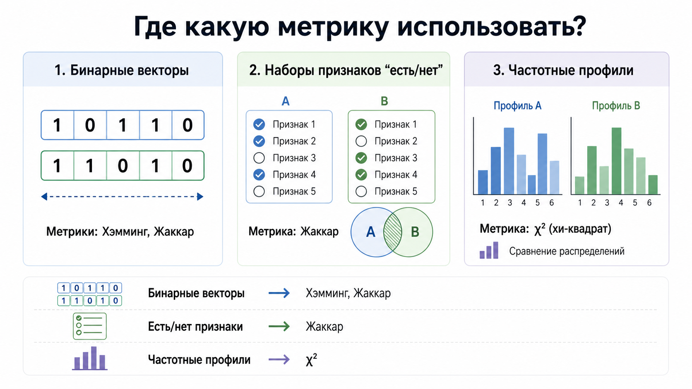
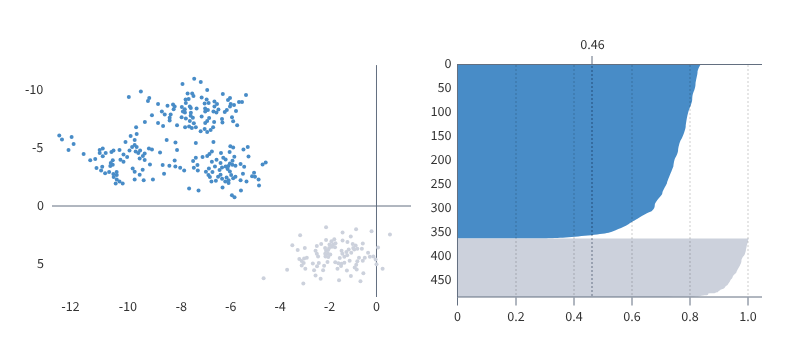

# Раздел V. Кластерный анализ
>
> *Cluster Analysis & Unsupervised Learning*

***

## 1. Сущность кластерного анализа

**Кластерный анализ** — это разбиение объектов на группы так, чтобы внутри группы объекты были похожи, а между группами — различны.[1][2]

**Кластер** — это подмножество объектов, для которого внутрикластерное сходство высоко, а межкластерное различие велико.[2][3]

Кластеризация относится к **обучению без учителя**, потому что правильные метки классов заранее неизвестны.[3][1]

### Зачем нужна кластеризация

- Сегментация клиентов.[4][1]
- Группировка документов и текстов.[5]
- Поиск типовых режимов работы оборудования.[3]
- Исследовательский анализ данных перед построением моделей.[6]

### Геометрическая идея

Каждый объект рассматривают как точку в пространстве признаков.


Тогда кластеризация — это поиск областей, где точки лежат плотнее и ближе друг к другу, чем к другим областям.[3][7]

```text
x2 ↑
   |      ● ● ●        ▲ ▲
   |    ● ● ● ●      ▲ ▲ ▲
   |      ● ●          ▲
   |
   |  ■ ■ ■
   | ■ ■ ■ ■
   +----------------------------→ x1
```

> Пример: покупатели могут естественно разбиться на «экономных», «премиальных» и «редких, но крупных».[4][1]

***

## 2. Цели и приложения

**Цель кластеризации** — обнаружить скрытую структуру данных без заранее заданных классов.[3][1]

### Типовые цели

- Найти естественные группы объектов.[1][3]
- Сжать описание данных через центроиды или прототипы.[8][9]
- Выявить аномальные точки, плохо принадлежащие кластерам.[6]
- Подготовить признаки для последующей классификации.[6]

### Практические приложения

| Область | Что кластеризуют | Зачем |
|---|---|---|
| Маркетинг | Клиентов | Персонализация офферов [4] |
| NLP | Документы, эмбеддинги | Тематические группы [5] |
| Медицина | Пациентов | Выделение фенотипов [3] |
| Компьютерное зрение | Пиксели, дескрипторы | Сегментация изображения [7] |

***

## 3. Теорема Клейнберга

**Теорема Клейнберга о невозможности** утверждает, что не существует функции кластеризации, которая одновременно удовлетворяет трем естественным аксиомам: масштабной инвариантности, богатству и консистентности.[10][11]


### Три свойства

- **Scale-invariance** — если все расстояния умножить на одну константу, результат кластеризации не должен измениться.[10]
- **Richness** — для любого разбиения объектов существует такая матрица расстояний, при которой алгоритм выдаст именно это разбиение.[10][11]
- **Consistency** — если расстояния внутри кластеров уменьшить, а между кластерами увеличить, разбиение не должно измениться.[10][11]

### Смысл теоремы

Нельзя построить один «идеальный» алгоритм кластеризации для всех задач.[10][11]

Поэтому выбор алгоритма всегда зависит от того, что считать правильной структурой данных.[11][12]

### Экзаменационная интерпретация

Теорема Клейнберга объясняет, почему в кластеризации так много разных алгоритмов: k-means, single linkage, Ward, DBSCAN и другие оптимизируют разные представления о «хорошем кластере».[11][12]

***

## 4. Геометрическая интерпретация кластеризации

В евклидовом пространстве кластеризацию можно понимать как разбиение множества точек на области близости.[3][7]

### Что значит «хороший кластер» геометрически

- Точки компактны.[3]
- Кластеры хорошо разделены.[3][6]
- Внутрикластерная дисперсия мала.[13]
- Межкластерные расстояния велики.[14]

### Для k-means

Каждая точка относится к ближайшему центроиду.[8][9]

Пространство разбивается на области Вороного вокруг центроидов.[3]

```text
точки → ближайший центр → кластер
```

### Ограничение геометрической картины

Если кластер вытянут, серповиден или имеет сложную форму, k-means может ошибаться, потому что хорошо работает в основном с компактными и выпуклыми кластерами.[6][15]

***

## 5. Определение кластера и свойства

**Кластер** — это группа объектов, обладающих большей близостью друг к другу по выбранной метрике, чем к объектам других групп.[2][3]

### Основные свойства кластера

- **Компактность** — объекты внутри кластера близки.[13]
- **Отделимость** — кластер удалён от других кластеров.[14]
- **Связность** — внутри кластера можно пройти от точки к точке через цепочку близких соседей.[11]
- **Устойчивость** — небольшие изменения данных не должны сильно менять кластеризацию.[12]
- **Интерпретируемость** — кластер должен иметь содержательный смысл в предметной области.[4][5]

### Пример

Если сегмент клиентов содержит людей с похожими чеками, частотой покупок и каналом взаимодействия, то такой кластер и компактный, и интерпретируемый.[4]

***

## 6. Метрики расстояния: количественные переменные


**Метрика расстояния** — правило, задающее численную меру различия между двумя объектами.[3][7]

Пусть есть два объекта:

$a = (a_1, a_2, \dots, a_n), \quad b = (b_1, b_2, \dots, b_n)s$

### Евклидово расстояние

a math:
$$
d_E(a,b)=\sqrt{\sum_{i=1}^{n}(a_i-b_i)^2}
$$

Это обычная длина отрезка между точками.[3][7]

> Пример: расстояние между покупателями по признакам «возраст» и «доход».[4]

### Манхэттенское расстояние

$$
d_M(a,b)=\sum_{i=1}^{n}|a_i-b_i|
$$

Это сумма модулей отклонений по координатам.[3]

Оно более устойчиво к выбросам, чем Евклидово.[3]

### Расстояние Минковского

$$
d_p(a,b)=\left(\sum_{i=1}^{n}|a_i-b_i|^p\right)^{1/p}
$$

Это обобщение Евклидовой и Манхэттенской метрик.[3]

- При $$p=1$$ получаем Манхэттен.[3]
- При $$p=2$$ получаем Евклидово расстояние.[3]

### Расстояние Махаланобиса

$$
d_{Mah}(a,b)=\sqrt{(a-b)^T S^{-1}(a-b)}
$$

где $$S$$ — ковариационная матрица признаков.[3]

Эта метрика учитывает масштаб признаков и их коррелированность.[3]

> Пример: если два признака сильно коррелируют, Махаланобис не будет считать их двойным вкладом в расстояние.[3]

### Практический вывод

Перед использованием Евклидовой метрики признаки обычно нормализуют, иначе признак с большим масштабом доминирует в расстоянии.[8][4]

***

## 7. Метрики расстояния: качественные переменные

Для категориальных и бинарных признаков обычное Евклидово расстояние часто неприменимо.[3][7]

### Расстояние Хэмминга

**Расстояние Хэмминга** — число позиций, в которых два вектора различаются.[3]

Для бинарных векторов:

$$
d_H(a,b)=\sum_{i=1}^{n}[a_i \neq b_i]
$$

> Пример: два пользователя описаны как векторы подписок 0/1.[3]

### Коэффициент Жаккара

**Коэффициент Жаккара** измеряет долю общих единичных признаков относительно объединения.[3][7]

$$
J(A,B)=\frac{|A \cap B|}{|A \cup B|}
$$

Расстояние Жаккара:

$$
d_J(A,B)=1-J(A,B)
$$

Он особенно полезен для разреженных бинарных данных.[3]

### Хи-квадрат расстояние

**Хи-квадрат расстояние** применяют для частотных таблиц, гистограмм и категориальных распределений.[7]

Одна из форм:

$$
d_{\chi^2}(a,b)=\sum_{i=1}^{n}\frac{(a_i-b_i)^2}{a_i+b_i}
$$

Оно подчёркивает относительное различие частот.[7]

### Где что использовать



| Тип данных | Подходящая метрика |
|---|---|
| Бинарные векторы | Хэмминг, Жаккар [3] |
| Наборы признаков «есть/нет» | Жаккар [3] |
| Частотные профили | Хи-квадрат [7] |

***

## 8. Расстояние между кластерами


Если кластеризация иерархическая, нужно определить, как измерять расстояние не между точками, а между целыми кластерами.[14][13]

### Ближайший сосед (single linkage)

Расстояние между кластерами — минимальное расстояние между их объектами.[14]

$$
d(A,B)=\min_{a\in A, b\in B} d(a,b)
$$

Этот метод хорошо улавливает цепочечные структуры, но страдает эффектом chaining.[14][11]

### Дальний сосед (complete linkage)

Расстояние между кластерами — максимальное расстояние между объектами двух кластеров.[14]

$$
d(A,B)=\max_{a\in A, b\in B} d(a,b)
$$

Он предпочитает компактные кластеры.[14]

### Центроидный метод

Каждый кластер заменяют его центроидом, а расстояние считают между центроидами.[14]

Если центроид кластера A равен $$\mu_A$$, а B — $$\mu_B$$, то:

$$
d(A,B)=d(\mu_A,\mu_B)
$$

### Метод Варда

**Метод Варда** объединяет те два кластера, после слияния которых прирост внутрикластерной суммы квадратов минимален.[13][14]

Идея метода: минимизировать рост внутри-кластерной дисперсии.[13]

Это делает кластеры компактными и примерно сферическими.[13][14]

### Сравнение linkage-методов


| Метод | Что минимизирует / использует | Особенность |
|---|---|---|
| Single | min расстояние | Цепочки, чувствителен к мостам [14] |
| Complete | max расстояние | Компактные группы [14] |
| Centroid | центроиды | Геометрически интуитивен [14] |
| Ward | прирост SSE | Хорош для компактных кластеров [13][14] |

***

## 9. Иерархические агломеративные методы

**Агломеративная кластеризация** — это подход «снизу вверх»: сначала каждый объект считается отдельным кластером, затем ближайшие кластеры последовательно объединяются.[2][16]

### Алгоритм

1. Начать с $$n$$ кластеров по одному объекту.[2]
2. Вычислить матрицу расстояний.[2][17]
3. Найти пару ближайших кластеров по выбранному linkage-критерию.[14]
4. Объединить их.[2][16]
5. Пересчитать расстояния между новым кластером и остальными.[14]
6. Повторять до получения одного корневого кластера.[2]

### Плюсы

- Не нужно заранее задавать число кластеров.[17][2]
- Даёт полную иерархию вложенных групп.[17]
- Удобна для визуализации через дендрограмму.[1][17]

### Минусы

- Вычислительно дороже k-means.[17][16]
- Ошибочное раннее слияние нельзя отменить.[17]

***

## 10. Дендрограмма

**Дендрограмма** — это дерево, показывающее порядок и уровни слияния кластеров в иерархической кластеризации.[1][17]


На вертикальной оси обычно откладывают расстояние или критерий слияния.[1]

Чем выше объединение, тем менее похожи были объединяемые кластеры.[17]

### Как читать дендрограмму

- Листья внизу — отдельные объекты.[17]
- Внутренние узлы — результат объединений.[17]
- Горизонтальный разрез дерева задаёт число кластеров.[1]

> В статье Habr по кластерному анализу в R число кластеров выбирали визуально, проводя горизонтальную линию по дендрограмме.[1]

Схема иерархической кластеризации и дендрограммы: [Habr — Кластерный анализ в R](https://habr.com/ru/articles/685040/).[1]

***

## 11. Алгоритм k-средних

**k-means** — итерационный алгоритм, разбивающий объекты на $$k$$ кластеров так, чтобы минимизировать сумму квадратов расстояний до центроидов.[8][9]

### Целевая функция

$$
J = \sum_{j=1}^{k}\sum_{x_i \in C_j} ||x_i-\mu_j||^2
$$

где $$\mu_j$$ — центроид j-го кластера.[8][9]

### Алгоритм пошагово

1. Выбрать число кластеров $$k$$.[8]
2. Инициализировать $$k$$ центроидов.[18]
3. Назначить каждую точку ближайшему центроиду.[8][9]
4. Пересчитать центроиды как среднее по точкам кластера.[9]
5. Повторять шаги 3–4 до сходимости.[8][6]

### Что значит «сходимость»

Обычно — когда центроиды почти не меняются или перестают меняться назначения точек по кластерам.[6]

### K-means++

**K-means++** — улучшенная инициализация центроидов, уменьшающая риск плохого локального минимума.[18]

### Визуальный пример


Источник изображения: [Habr — Кластеризуем лучше, чем метод локтя](https://habr.com/ru/companies/jetinfosystems/articles/467745/).[15]

Дополнительный пример кластеров на плоскости: .

### Ограничения k-means

- Нужно заранее знать $$k$$.[8][15]
- Чувствителен к выбросам.[19]
- Лучше работает на выпуклых компактных кластерах примерно одинакового размера.[6][15]
- Требует нормализации признаков.[8]

***

## 12. Выбор числа кластеров: метод локтя

**Метод локтя** выбирает такое число кластеров $$k$$, после которого уменьшение внутрикластерной ошибки замедляется.[8][20]


Обычно строят график зависимости WCSS или inertia от $$k$$.[8][15]

$$
WCSS(k)=\sum_{j=1}^{k}\sum_{x_i \in C_j} ||x_i-\mu_j||^2
$$

### Идея

- При малом $$k$$ ошибка большая.[8]
- При увеличении $$k$$ ошибка падает.[8]
- В точке перегиба выигрыш от нового кластера становится небольшим.[15][20]

### Практический смысл

«Локоть» — разумный компромисс между простотой модели и качеством разбиения.[15][20]

***

## 13. Выбор числа кластеров: метод силуэта



**Силуэт** измеряет, насколько объект похож на свой кластер по сравнению с соседним кластером.[6]

Для объекта $$i$$:

- $$a(i)$$ — среднее расстояние до объектов своего кластера.[6]
- $$b(i)$$ — среднее расстояние до объектов ближайшего другого кластера.[6]

Тогда коэффициент силуэта:

$$
s(i)=\frac{b(i)-a(i)}{\max(a(i),b(i))}
$$

### Интерпретация

- $$s(i) \approx 1$$ — объект хорошо вписан в свой кластер.[6]
- $$s(i) \approx 0$$ — объект на границе кластеров.[6]
- $$s(i) < 0$$ — объект, вероятно, отнесён не в тот кластер.[6]

### Как выбирать число кластеров

Считают средний силуэт по выборке и берут $$k$$, где он максимален.[6]

### Отличие от локтя

Метод локтя опирается на убывание ошибки, а силуэт — на качество разделения и компактность кластеров.[6][15]

***

## 14. Быстрая карта темы


```text
Кластеризация
 ├─ Что это? → разбиение без меток
 ├─ Чем мерим близость?
 │   ├─ Количественные признаки → Euclidean, Manhattan, Minkowski, Mahalanobis
 │   └─ Качественные признаки → Hamming, Jaccard, χ²
 ├─ Как объединяем кластеры?
 │   ├─ Single linkage
 │   ├─ Complete linkage
 │   ├─ Centroid
 │   └─ Ward
 ├─ Какие методы?
 │   ├─ Иерархическая агломеративная
 │   └─ K-means
 └─ Как выбрать k?
     ├─ Метод локтя
     └─ Метод силуэта
```

***

## 15. YouTube-лекции

### На русском

- [Поиск YouTube: кластерный анализ на русском](https://www.youtube.com/results?search_query=кластерный+анализ+на+русском)
- [Поиск YouTube: k-means и метод локтя на русском](https://www.youtube.com/results?search_query=k-means+метод+локтя+на+русском)
- [Поиск YouTube: иерархическая кластеризация дендрограмма на русском](https://www.youtube.com/results?search_query=иерархическая+кластеризация+дендрограмма+на+русском)
- [Поиск YouTube: silhouette score clustering на русском](https://www.youtube.com/results?search_query=silhouette+score+clustering+на+русском)

### На английском

- [StatQuest: K-means clustering](https://www.youtube.com/results?search_query=StatQuest+K-means+clustering)
- [StatQuest: Hierarchical clustering](https://www.youtube.com/results?search_query=StatQuest+Hierarchical+clustering)
- [Silhouette score explained](https://www.youtube.com/results?search_query=Silhouette+score+explained)
- [Ward linkage explained](https://www.youtube.com/results?search_query=Ward+linkage+explained)
