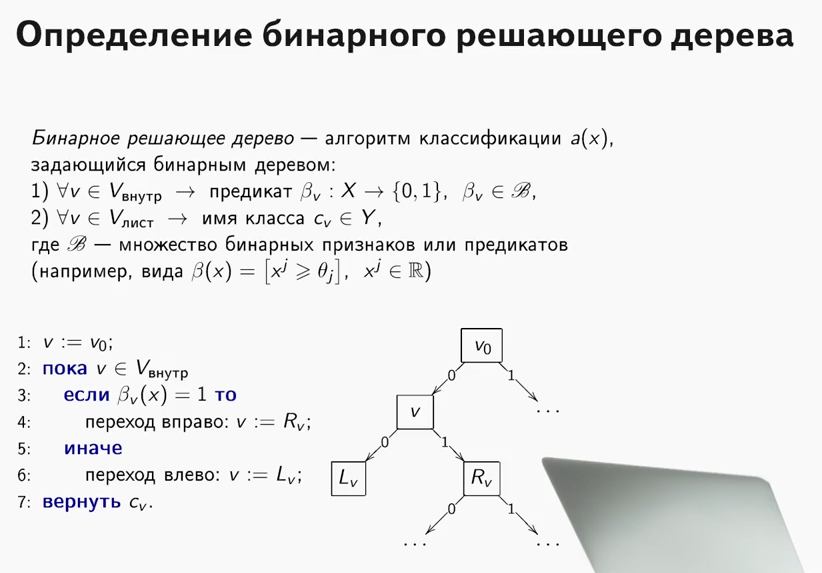

# Раздел VI. Классификация: символические и вероятностные методы
>
> *Classification: Rule-based & Probabilistic Models*

---

## 1. Классификационные правила: сущность и виды

**Классификационное правило** — это условие вида «ЕСЛИ ... ТО класс = ...».  
Правило использует значения признаков объекта и возвращает метку класса.

Пример текстового правила:

```text
ЕСЛИ (доход > 100 000) И (возраст < 30)
ТО класс = "Премиальный клиент"
```

Правила могут быть:

- **Одинарные** (по одному признаку).  
- **Комбинированные** (логические связки И, ИЛИ).  
- **Детерминированные** (однозначная метка).  
- **Вероятностные** (выдают вероятность классов).

Правила лежат в основе:

- Простых rule-based систем.  
- Узлов деревьев решений.  
- Продукционных экспертных систем.

---

## 2. 1R‑алгоритм классификации

**1R (One Rule)** — базовый алгоритм, строящий классификатор по ОДНОМУ признаку.

Идея: найти один признак, который даёт наименьшую ошибку при разбиении на классы.

### Шаги алгоритма 1R

1. Для каждого признака разбить обучающие объекты по значениям признака.  
2. В каждой группе выбрать **моду** класса как предсказание для этого значения.  
3. Посчитать ошибку для признака (сколько объектов в группах не совпали с модой).  
4. Выбрать признак с минимальной ошибкой.  
5. Итоговый классификатор — набор простых правил «значение → класс».

Схема:

```text
Признак: "Цвет"  (Зелёный, Жёлтый, Красный)
Зелёный → чаще класс "Хороший"
Жёлтый → чаще класс "Средний"
Красный → чаще класс "Плохой"
```


1R полезен как **baseline** и для иллюстрации идеи правил.

---

## 3. Наивный байесовский классификатор


### 3.1 Теорема Байеса

**Теорема Байеса** связывает априорную и апостериорную вероятность события.


$P(C \mid X) = \frac{P(X \mid C)\,P(C)}{P(X)}$

где:

- \(C\) — класс.  
- \(X\) — признаки объекта.

### 3.2 Идея наивного Байеса

Документ (объект) представляют как набор признаков (слов, признаков поведения и т.п.).  
Главное допущение: **условная независимость признаков при заданном классе**.

Тогда:


### $P(C \mid x_1, \dots, x_n) \propto P(C)\prod_{i=1}^{n} P(x_i \mid C)$

Класс с максимальным значением этой величины выбирается как ответ.

### 3.3 Формулы для разных типов признаков

- **Для категориальных признаков** (мультиномиальный NB):


### $P(x_i=v \mid C) = \frac{\text{count}(x_i=v, C) + \alpha}{\text{count}(C) + \alpha\cdot |V_i|}$

где \(\alpha\) — сглаживание Лапласа.

- **Для непрерывных признаков** (Gaussian NB):

\[
P(x_i \mid C) = \frac{1}{\sqrt{2\pi\sigma_{i,C}^2}}
\exp\left(-\frac{(x_i-\mu_{i,C})^2}{2\sigma_{i,C}^2}\right)
\]

где \(\mu_{i,C}, \sigma_{i,C}\) — оценённые по обучению среднее и СКО.

### 3.4 Пример (спам-фильтр)

- Классы: `Спам`, `Не спам`.  
- Признаки: слова «скидка», «кредит», «подписка» и т.п.

Интуиция:

```text
P(Спам | письмо) ∝ P(Спам) · P(слово_1 | Спам) · ... · P(слово_n | Спам)
P(Не спам | письмо) ∝ P(Не спам) · P(слово_1 | Не спам) · ...
```

Письмо относят к классу с большей апостериорной вероятностью.

Пример границ классов для наивного Байеса (по Iris):

  
Источник: [Habr — Наивный байесовский классификатор][https://habr.com/ru/articles/802435/](web:81)[image:341]

---

## 4. Плюсы и минусы наивного Байеса

### Преимущества

- Очень **быстрая** тренировка и предсказание.  
- Неплохо работает на малых выборках.  
- Устойчив к переобучению.  
- Хорош для разреженных текстовых данных (спам, тональность).  

### Недостатки

- Предположение независимости признаков часто нарушается.  
- Плохо учитывает сильные взаимодействия признаков.  
- Вероятности могут быть «излишне уверенными» из-за наивного произведения.
Несмотря на «наивность», показывает хорошие практические результаты.
---

## 5. Деревья решений: общее представление

**Дерево решений** — модель в виде дерева «вопрос → ветка → лист», где лист — предсказание класса или числа.

Каждый внутренний узел хранит условие вида:

```text
ЕСЛИ признак_j ≤ порог_a ИДТИ влево, иначе вправо
```

Путь от корня до листа — это **последовательность правил**.

Дерево легко визуализировать и объяснять.



---

## 6. Критерии ветвления: энтропия, Information Gain, Gain Ratio, Джини

### 6.1 Энтропия

**Энтропия** измеряет «хаос» распределения классов в узле.


$H(S) = -\sum_{k} p_k \log_2 p_k$

где $p_k$ — доля объектов класса \(k\) в узле.

- Энтропия = 0, если в узле один класс.  
- Максимальна при равных долях классов.

### 6.2 Information Gain (прирост информации)


$IG(S, \text{split}) = H(S) - \sum_{j} \frac{|S_j|}{|S|} H(S_j)$

где $S_j$ — подвыборки после разбиения.

Разбиение хорошее, если сильно уменьшает энтропию.

### 6.3 Gain Ratio

В C4.5 используют **Gain Ratio**, чтобы не предпочитать сплиты с большим числом ветвей.

\[
GR = \frac{IG}{\text{SplitInfo}}
\]

SplitInfo ≈ энтропия распределения по ветвям.  
Такое деление нормализует IG.

### 6.4 Коэффициент Джини

**Импьюрити Джини**:


$G(S) = 1 - \sum_{k} p_k^2$

Интерпретация: вероятность неправильной классификации, если класс выбирать случайно по распределению.

В sklearn Gini используется по умолчанию для деревьев.

---

## 7. Этапы построения дерева и типы ветвления

### 7.1 Базовый алгоритм построения дерева

1. В корень попадает вся обучающая выборка.  
2. Для каждого признака ищется разбиение, максимизирующее уменьшение impurity (Gini / entropy).  
3. Выбирается лучший split, данные делятся на два поддерева.  
4. Алгоритм рекурсивно повторяется в каждом поддереве.  
5. Когда критерий остановки выполняется — вершина становится листом.

Схема (из статьи VK / XGBoost):  
[Habr — деревья и ансамбли, рисунок структуры дерева][https://habr.com/ru/companies/vk/articles/438560/]

### 7.2 Типы ветвления (criterion / split)

- Для **классификации**: Gini или entropy.  
- Для **регрессии**: MSE или MAE.  
- Для категориальных признаков: сравнение с множеством значений.  
- Для числовых: сравнение с порогом (feature ≤ threshold).

---

## 8. Критерии и правила остановки. Пре- и постобрезка

### 8.1 Пре-обрезка (pre-pruning)

Останавливаем рост дерева заранее:

- Ограничение глубины дерева (max_depth).  
- Минимальное число объектов в узле (min_samples_split, min_samples_leaf).  
- Ограничение числа листьев (max_leaf_nodes).  
- Порог минимального прироста impurity (min_impurity_decrease).

### 8.2 Пост-обрезка (post-pruning)

Сначала строится «полное» дерево, затем:

- Листья/поддеревья, мало улучшающие качество, удаляются.  
- Критерий — либо кросс‑валидация, либо penalized-ветвление.

Смысл: уменьшить переобучение, сделать дерево проще.

---

## 9. Алгоритм CART


**CART (Classification And Regression Trees)** — фундаментальный алгоритм деревьев от Breiman et al.

Особенности:

- Двоичное дерево (каждый узел делится на 2 ветки).  
- Для классификации использует Gini или entropy.  
- Для регрессии — MSE/MAE.  
- Может работать с числовыми и категориальными переменными.

Целевая функция для классификации:

\[
\Delta G = G(parent) -
\left(\frac{N_L}{N} G(L) + \frac{N_R}{N} G(R)\right)
\]

Выбирается split с максимальным \(\Delta G\).

Реализации CART лежат в основе scikit-learn DecisionTreeClassifier / Regressor и многих ансамблей (Random Forest, Gradient Boosting).

---

## 10. Фундаментальные алгоритмы: ID3, C4.5, CART, CHAID

### ID3

- Автор: Quinlan.  
- Использует **энтропию** и **Information Gain** как критерий сплита.  
- Работает в основном с категориальными признаками.  
- Без глубокой обработки пропусков и непрерывных признаков.

### C4.5

- Расширение ID3.  
- Критерий сплита: **Gain Ratio**.  
- Умеет работать с непрерывными признаками (поиск порога).  
- Обрабатывает пропуски.  
- Поддерживает пост-обрезку дерева.

### CART

- Описан выше.  
- Двоичные сплиты, Gini/entropy/MSE.  
- Единый формализм для классификации и регрессии.

### CHAID

- Основан на статистике **χ²**.  
- Выбирает сплиты, максимально различающие распределения классов.  
- Часто используется в маркетинговой аналитике.

### Сводная таблица

| Алгоритм | Критерий | Тип сплитов | Признаки | Особенности |
|---|---|---|---|---|
| ID3 | Entropy, IG | Многозначные | Категориальные | Простота, ранний исторический |
| C4.5 | Gain Ratio | Многозначные | Категор. + непрерывные | Постобрезка, обработка пропусков |
| CART | Gini / Entropy / MSE | Всегда бинарные | Все типы | База для sklearn, RF, GBM |
| CHAID | χ² | Многозначные | Категор./ordinal | Аналитика, маркетинг |

---

## 11. Преимущества и недостатки решающих деревьев

### Преимущества

- **Интерпретируемость**: легко объяснить путь решения.  
- Поддержка **числовых и категориальных** признаков.  
- Не требуется нормализация признаков.  
- Естественно моделируют **нелинейные** зависимости и взаимодействия.

### Недостатки

- Легко переобучаются при большой глубине.  
- Чувствительны к небольшим изменениям данных (нестабильность).  
- Плохо экстраполируют за пределы обучающего диапазона (для регрессии).  
- Глобальная оптимизация сложна (жадный локальный поиск сплитов).

Именно поэтому деревья часто используют в **ансамблях** (Random Forest, Gradient Boosting), а не поодиночке.

---

## 12. Наглядная карта раздела

```text
Классификация
 ├─ Правила
 │   ├─ 1R (одно правило)
 │   └─ Rule-based системы
 ├─ Вероятностные модели
 │   └─ Наивный Байес (P(C|X) ∝ P(C)·∏P(x_i|C))
 └─ Деревья решений
     ├─ Критерии: Gini, Entropy, Gain Ratio
     ├─ Алгоритмы: ID3, C4.5, CART, CHAID
     ├─ Регуляризация: max_depth, min_samples_leaf, pruning
     └─ База для ансамблей (RF, GBM)
```

---

## 📚 YouTube‑лекции (для этого раздела)

### На русском

- **Наивный Байес** — [поиск](https://www.youtube.com/results?search_query=наивный+байесовский+классификатор+на+русском)  
- **Деревья решений, Gini / Entropy** — [поиск](https://www.youtube.com/results?search_query=деревья+решений+gini+entropy+на+русском)  
- **Сравнение ID3 / C4.5 / CART** — [поиск](https://www.youtube.com/results?search_query=ID3+C4.5+CART+на+русском)

### На английском

- StatQuest — **Naive Bayes**:  
  <https://www.youtube.com/results?search_query=StatQuest+Naive+Bayes>  
- StatQuest — **Decision Trees** (Gini, Entropy):  
  <https://www.youtube.com/results?search_query=StatQuest+Decision+Trees>  
- **ID3 vs C4.5 vs CART** обзор:  
  <https://www.youtube.com/results?search_query=ID3+C4.5+CART+decision+tree+comparison>
